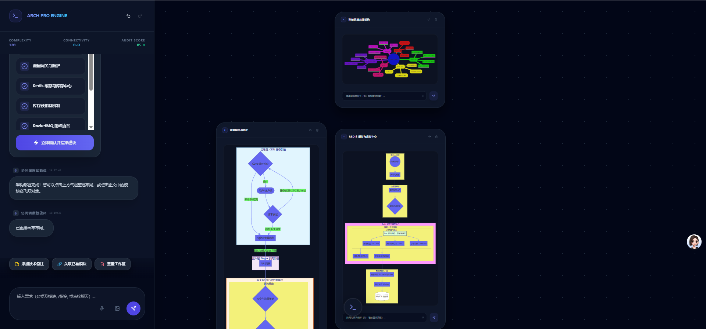

# 🧬 多智能体图表架构专家 (Multi-Agent Diagram Architect)

**Multi-Agent Diagram Architect** 是一款基于 Google Gemini 3 Pro 引擎驱动的次世代生产力工具。它将「无限画布」与「生成式 AI」深度结合，通过多智能体协同工作流，将晦涩复杂的长篇文本、需求文档或业务流程自动解构为直观、可交互且具美感的图表生态系统。

---

## 🚀 核心特性

### 1. 深度内容解构 (Deep Deconstruction)
系统会分析输入全文，识别核心实体与逻辑链路，自动决策最适合的图表类型（流程图、时序图、甘特图或思维导图），并将其拆解为多个互联的逻辑模块。

### 2. 语义引用与“一键飞跃” (Semantic Teleport)
- **智能实体高亮**：AI 在对话中提到模块名称（如：【支付网关】）时，会自动将其转化为可点击的“语义锚点”。
- **呼吸灯定位**：点击锚点，画布将平滑平移并自动缩放聚焦至对应卡片，并触发一次深蓝色的呼吸灯高亮效果。

### 3. @ 提及系统与定向指令 (Mention System)
- **精准引用**：在输入框键入 `@` 符号，系统会立即弹出当前画布上的所有卡片列表。
- **关联交互**：支持针对特定卡片的定向指令（例如：`把 @认证模块 里的逻辑合并到 @网关模块`），极大地降低了手动描述背景的成本。

### 4. 智能指令上下文增强 (Quick Actions)
- **动态建议气泡**：根据当前画布状态和 AI 消息上下文，自动推荐后续操作（如：“执行并发风险审计”、“整理布局”、“导出为工程存档”）。
- **指哪打哪**：在卡片内部集成独立的 AI 对话框，支持针对局部细节的微调。

---

## 🤖 多智能体协同架构 (Agent Workflow)

系统内部运行着一套严密的智能体协议：

| 智能体角色 | 核心职责描述 |
| :--- | :--- |
| **协同调度 (Scheduler)** | 全局逻辑统筹，负责任务分发与拓扑关系确立。 |
| **分类层级 (Classifier)** | 语义提取专家，从长文中抽离实体、建立层级规划。 |
| **绘图执行 (Generator)** | Mermaid 代码专家，负责生成高语义、美观的拓扑代码。 |
| **架构审计 (Reviewer)** | 资深评审专家，扫描系统逻辑漏洞与性能瓶颈。 |
| **交互反馈 (Feedback)** | 负责将系统状态以优雅的视觉动效（如呼吸灯、飞跃动画）反馈给用户。 |

---

## ⌨️ 快捷操作指南

### 鼠标操作
- **滚轮 (Wheel)**：以指针为中心的缩放 (Zoom-to-Mouse)。
- **Space + 左键拖拽**：临时切换到“抓手模式”平移画布。
- **点击消息锚点**：执行“一键飞跃”定位。

### 指令系统
- **[@]**：呼出卡片列表进行语义提及。
- **[/]**：呼出全局指令列表（如 `/layout`, `/review`, `/save`）。
- **[Enter]**：提交指令。

---

## 🛠 技术栈概览

- **核心引擎**: Google Gemini 3 Pro (通过 `@google/genai` 实时流式调用)。
- **前端架构**: React 19 (Hooks & Memo 优化) + TypeScript。
- **渲染引擎**: Mermaid.js 高性能异步渲染调度器。
- **空间管理**: 自研 Hierarchical Layout 算法与 Teleport 动画系统。

---
*Developed by Senior AI Engineering Team | Last Updated: 2025-05-21*
